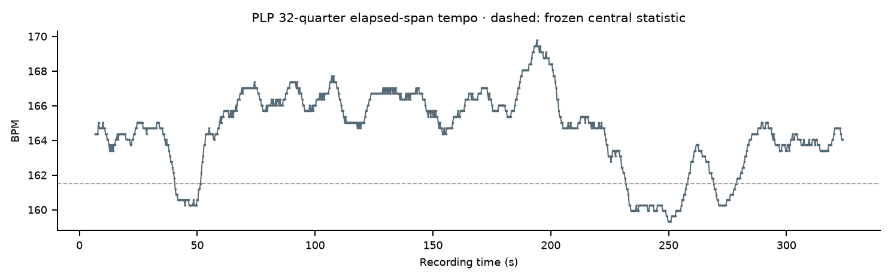

# JGA Historical Report 001 — Final musicological profile

**Ray Brown Trio — Exactly Like You** · analyzed 0–330 seconds · 4/4.

[Complete A4 Microtiming Score — 15 pages](JGA_MICROTIMING_SCORE.pdf) · [BPM evolution](BPM_EVOLUTION.png) · [pair register](MICROTIMING_PAIRS.csv).

## Tempo

| Start | Central / typical | End | Change | Direction |
|---:|---:|---:|---:|---|
| 164.39 BPM | 161.499 BPM | 164.06 BPM | -0.33 BPM / -0.20% | Small endpoint decrease |

The local-tempo curve varies during the performance rather than moving steadily in one direction. The ending window is 0.33 BPM slower than the opening window; this does not imply an intentional rallentando. Local values describe 32 quarter intervals; the central value retains its separate established median definition.

## Instrument placement

| Observation | N | Median | Mean | Before beat | After beat | Exact |
|---|---:|---:|---:|---:|---:|---:|
| Bass → beat | 23 | **−34.83 ms** | −22.72 ms | 65.22% | 34.78% | 0% |
| Drum → beat | 654 | **+11.61 ms** | +7.38 ms | 29.36% | 62.23% | 8.41% |

The identifiable non-shared Bass observations tend to lie before the internal beat, by 34.83 ms at the median. Drum observations tend to follow it, by 11.61 ms at the median. This describes these measured populations; 23 Bass observations do not represent every Bass note.

## Bass and Drum together

For **21 distinct pairs**, median **Drum−Bass is +46.44 ms**; mean +17.14 ms. Bass precedes Drum in **14/21 (66.67%)**; Drum precedes Bass in **7/21 (33.33%)**; none is exact. Positive separation means Bass first. These are direct paired measurements, not subtraction of the two instrument medians.

## Placement by metric beat

Beat 1 is established by the PI at the existing 0.8126984126984127-second reference, Q3/M1. Numbering continues in 4/4 without moving any reference. Q1–Q2 precede the validated measure origin. There are 225 complete measures and a final M226 with three available quarters.

| Beat | Bass N | Bass median ms | Drum N | Drum median ms | Pair N | Median Drum−Bass ms |
|---|---:|---:|---:|---:|---:|---:|
| 1 | 8 | -69.66 | 160 | +11.61 | 7 | +104.49 |
| 2 | 4 | -40.63 | 167 | +23.22 | 4 | +63.85 |
| 3 | 7 | -23.22 | 172 | +11.61 | 7 | +34.83 |
| 4 | 4 | +0.00 | 155 | +11.61 | 3 | +58.05 |

| Beat | Bass before / after % | Drum before / after / exact % | Bass first / Drum first % |
|---|---:|---:|---:|
| 1 | 75.00 / 25.00 | 28.12 / 61.25 / 10.62 | 71.43 / 28.57 |
| 2 | 75.00 / 25.00 | 24.55 / 67.66 / 7.78 | 75.00 / 25.00 |
| 3 | 57.14 / 42.86 | 34.88 / 57.56 / 7.56 | 57.14 / 42.86 |
| 4 | 50.00 / 50.00 | 29.68 / 62.58 / 7.74 | 66.67 / 33.33 |

**Descriptive only:** Bass and pair counts are small at every beat. Bass medians are earlier on beats 1–3 and approximately zero on beat 4; Drum medians are positive on all four beats, with the largest median on beat 2. Pair medians favor Bass first at each position, but samples of 3–7 pairs do not establish a general metric-position rule. The near-zero beat-4 Bass median does not mean its four observations are individually simultaneous with the beat.

## Noteworthy pairs for future listening

Closest absolute separation: **P12, P13 and P21**, each **34.83 ms**, Bass first. Most separated: **P05 and P14**, each **139.32 ms**, Drum first (signed Drum−Bass −139.32 ms). Stable IDs and exact coordinates are preserved in the pair register; no speculative annotation has been added.

The score shows selected Bass landmarks in blue and Drum in orange, with unresolved Dual and other context in gray source-shaped symbols. Pair links preserve their original observations, including qualified Dual-supported endpoints shown in gray. The primary statistical cohorts remain unchanged; gray display does not remove an observation from its frozen cohort.

JGA measures source-associated observable onset timing relative to its internal PLP reference; these are not direct physical measurements of performer gesture. No formal-section analysis is used.
