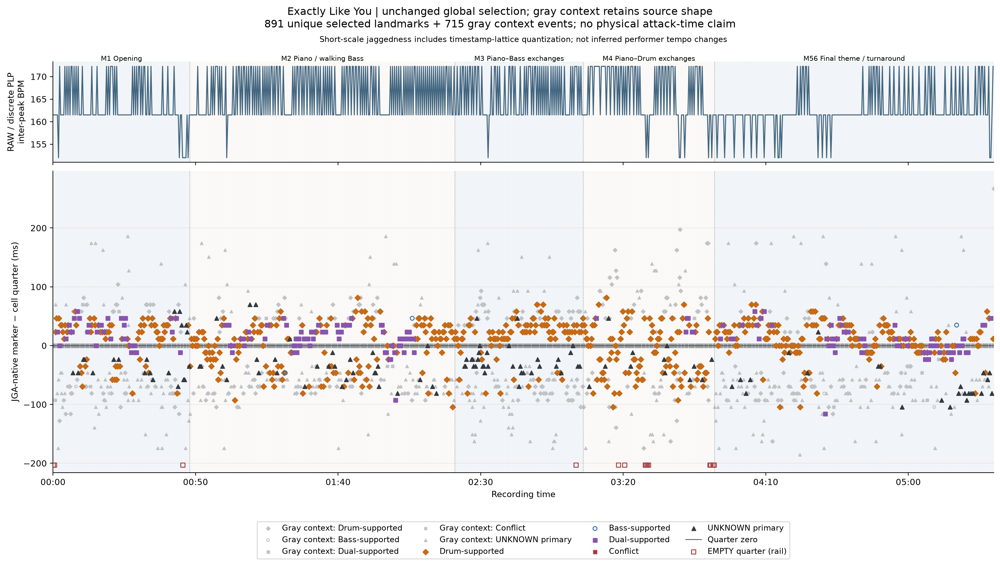
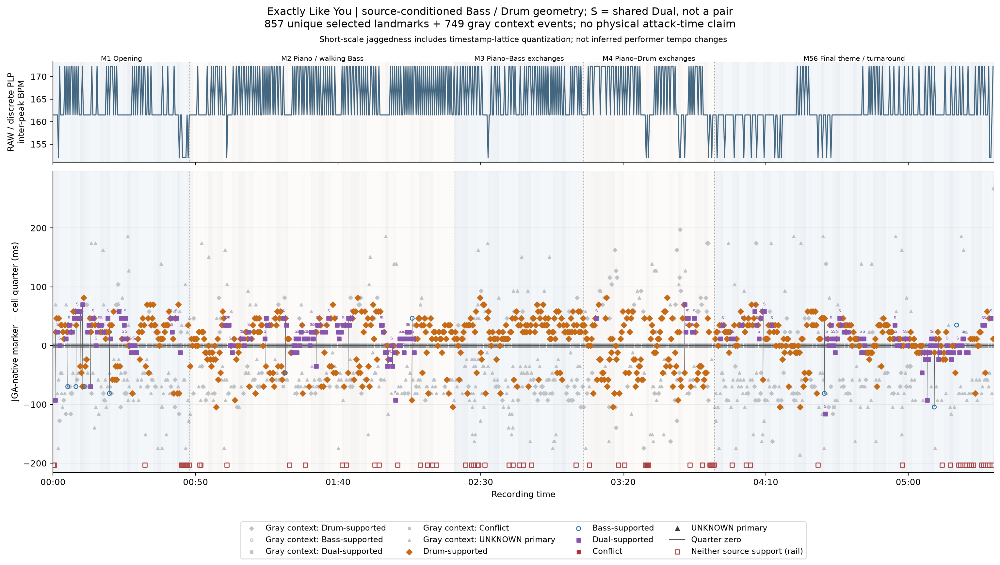
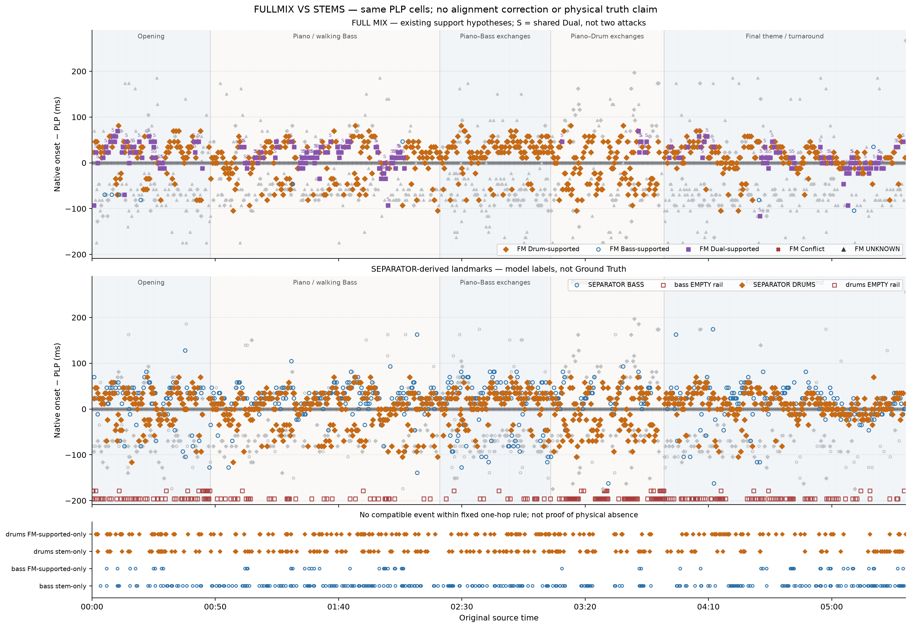
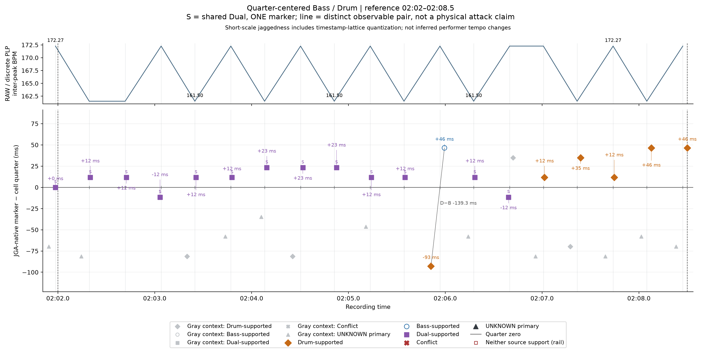
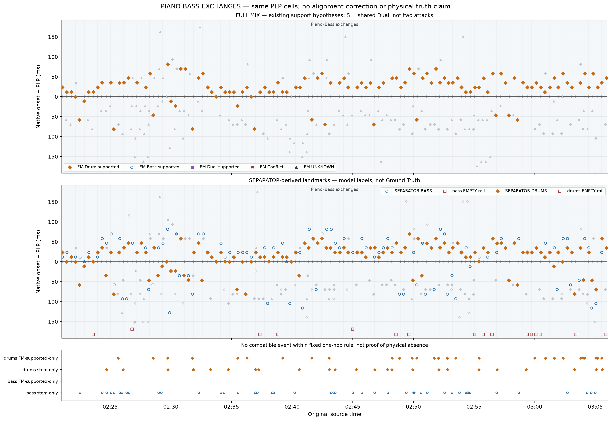

# JGA HISTORICAL REPORT 001

## Ray Brown Trio — “Exactly Like You”

**Historical jazz corpus analysis · JGA v1 · USABLE_WITH_QUALIFICATION**

This report consolidates completed, frozen evidence into the adopted historical-analysis format. No model, detector, separation or PLP execution was repeated. The findings describe observable onset geometry in this recording.

## 1. Recording identification

Artist/ensemble: **Ray Brown Trio**. Title: **Exactly Like You**. Original registered source: `/Volumes/SSD Track/JGA/downloads/Ray Brown Trio - Exactly Like You.m4a`.

SHA-256: `aec97cfb67096bd6a7c3d432f025523d1269b6b261e2dd6bc01a33c045acac45`. Decoded duration: **347.811701 s**; 44,100 Hz, two channels, 15,338,496 frames. Analysis: **[0,330) s**. Excluded free/open ending: **[330,347.811701) s**. The original commercial full mix remains primary; separator audio is a derived representation.

Album, session date, label and detailed personnel: **NOT AVAILABLE in the evidence assembled for this report**. These remain for later bibliographic enrichment; none is inferred from a filename or timing result. The report uses the PI's 4/4 operational scope, not a new meter analysis.

## 2. JGA analysis method — short form

JGA places a frozen PLP temporal ruler over the original full mix and measures the positions of existing native onset landmarks around it. Qualified source evidence supports Bass, generic Drum, Dual or UNKNOWN interpretations. Authorized Demucs stems provide complementary source evidence; they do not supply an independent tempo ruler or physical truth.

When a stem observation matches a native full-mix event under the frozen rule, the report's provenance layer retains the **full-mix timestamp**, original source support and complementary stem evidence separately. Unmatched stem observations remain SEPARATOR_DERIVED / STEM_ONLY. This is a join of existing evidence, not a new classifier: the frozen global and source-conditioned assignments below are reused without relabelling or reselection.

`Δt = observable source-associated onset − PLP temporal reference`. Negative is before; positive after. Neither coordinate is snapped. These are acoustic landmarks, not exact finger release or stick contact. No numerical ON tolerance is imposed.

## 3. Musical form

**Table 1. Independently supplied PI form map.** Boundaries are approximate listening annotations, preserved from the operational study; they were not inferred from timing geometry.

| Section | Start–end (s) | Independent PI description |
| --- | --- | --- |
| Opening | 0–48 | Opening |
| Piano / walking Bass | 48–141 | Piano / walking Bass |
| Piano–Bass exchanges | 141–186 | Piano–Bass exchanges |
| Piano–Drum exchanges | 186–232 | Piano–Drum exchanges |
| Final theme / turnaround | 232–330 | Final theme / turnaround |

The final-theme/turnaround subdivision within 232–330 s is not independently resolved and is not invented here.

## 4. Internal tempo / PLP

The 905 frozen references yield 904 adjacent intervals entirely within the analysis domain. Their **median RAW / DISCRETE PLP INTER-PEAK BPM is 161.50 BPM**. The raw interval range is 152.00–172.27 BPM; the aggregate reference rate over the first-to-last reference span is 164.54 BPM. These different summaries answer different arithmetic questions.

This is a central operational pulse-rate description, not a continuous reconstruction of performer tempo. Much short-scale jaggedness reflects the 512-sample timestamp lattice (approximately 11.61 ms at 44.1 kHz). The figures label this limitation explicitly; saw-tooth appearance is not evidence of alternating performer acceleration/deceleration. No smoothing or new tempo estimate was introduced. Exact interval arithmetic is preserved in `data/RAW_PLP_INTERVALS.csv`.

## 5. Observable event population

**Table 2. Original full-mix source states and global selection.**

| Original full-mix state | Native events | Global selected |
| --- | --- | --- |
| Bass only | 9 | 3 |
| Drum only | 895 | 593 |
| Dual (one timestamp) | 196 | 174 |
| UNKNOWN | 506 | 121 |
| Total | 1606 | 891 |

905 reference cells contain **891 selected landmarks (98.45%)**, **14 EMPTY** and **715 non-selected CONTEXT events**. UNKNOWN remains eligible for selection. Inclusive native support is Bass **205 = 9 + 196** and Drum **1,091 = 895 + 196**; these counts overlap through Dual and must not be added as independent attacks.

The source-conditioned view covers **203 Bass cells** and **834 Drum cells**. Both support types occur in 201 cells: 21 have distinct selected timestamps, 180 share one Dual winner. Of the latter, 135 lack any distinct supported full-mix alternative. 69 cells contain neither source support.

The additive provenance join identifies **1232 unique native events with at least one compatible stem observation** and **952 unique native events whose original source support is also compatible with the corresponding stem**. These are compatibility counts, not independent identity validation. UNKNOWN remains 506 original events; no original state is overwritten. Zero ambiguous temporal matches does not mean zero source ambiguity.

## 6. Global quarter-nearest geometry

Each frozen midpoint-defined cell selects its nearest existing native onset. No event is borrowed or reused across cells. All other native events remain gray context, with source-specific shapes in this source-aware rendering.

**Figure 1.** Byte-preserved source-aware global figure. Colored markers are global winners; light-gray markers retain source shapes. EMPTY and independent form boundaries retain the frozen styling. The raw/discrete PLP panel contains lattice effects, not a literal continuous tempo trace.

**Table 3. Global selected-landmark statistics.** Milliseconds; SD is sample SD. These populations differ from source-conditioned selections in section 7.

| Global selected population | N | Median Δt ms | Mean ms | IQR ms | SD ms |
| --- | --- | --- | --- | --- | --- |
| ALL_SELECTED | 891 | +11.61 | +1.04 | 58.05 | 37.36 |
| BASS_SUPPORTED | 3 | +34.83 | +11.61 | 46.44 | 50.61 |
| DRUM_SUPPORTED | 593 | +11.61 | +4.64 | 46.44 | 36.80 |
| BASS_AND_DRUM_SUPPORTED | 174 | +11.61 | +13.41 | 34.83 | 23.20 |
| UNKNOWN | 121 | -34.83 | -34.64 | 34.83 | 35.78 |

All-selected MAD is 23.22 ms; median absolute displacement 23.22 ms; range −116.10 to +81.27 ms. Full category statistics, including MAD and ranges, are preserved in `data/global__SELECTED_STATISTICS.csv`. Only three global winners are Bass-only: losing global competition is not absence of Bass evidence.

## 7. Quarter-centered Bass / Drum geometry

Source-conditioned selection independently asks for the nearest Bass-supported and Drum-supported native event within the same cell. Shared Dual is one event, not two simultaneous attacks. Primary timing distributions exclude shared or same-timestamp unresolved winners; all-support slots are reported separately.

**Figure 2.** Frozen source-conditioned view. Additional source-supported observations can be visible even when they were gray context in the global view. Shared Dual and distinct pair semantics are preserved.

| Source-conditioned population | N | Median Δt ms | IQR ms | Negative / positive / exact |
| --- | --- | --- | --- | --- |
| BASS — PRIMARY_NONSHARED | 23 | -34.83 | 116.10 | 15 / 8 / 0 |
| DRUM — PRIMARY_NONSHARED | 654 | +11.61 | 46.44 | 192 / 407 / 55 |
| DRUM_MINUS_BASS — DISTINCT_PAIRS_ONLY | 21 | +46.44 | 185.76 | 7 / 14 / 0 |

For the 21 distinct pairs, positive `Drum − Bass` means Bass precedes Drum: **14 positive, 7 negative**, median **+46.44 ms**, IQR **185.76 ms**. This small, dispersed subset does not support a universal ordering claim.

Including shared support changes the Bass population substantially: ALL_SUPPORT_SLOTS N=203 has median **+11.61 ms**, rather than the non-shared subset's −34.83 ms. Drum ALL_SUPPORT_SLOTS N=834 also has median +11.61 ms. Those shared slots are not independent timed attacks. The non-shared Bass tendency must not be generalized to all Bass activity.

## 8. Hybrid full-mix / stem evidence

**Table 5. Hybrid provenance and coverage.** Corresponding-support matches differ from matches to any full-mix state. Stem-only means no compatible native event, not independently verified new instrumental activity.

| Evidence count | Bass | Drum |
| --- | --- | --- |
| Original source-supported native events, inclusive | 205 | 1091 |
| Corresponding stem-compatible support | 148 | 923 |
| Source-supported full-mix-only | 57 | 168 |
| Stem-only, unmatched to any native event | 279 | 156 |
| All-state full-mix/stem matches | 548 | 1071 |
| Stem events | 827 | 1227 |
| Covered cells: full mix → stem | 203 → 672 | 834 → 868 |

Matching reuses the inclusive one-hop bound, **512 samples / 11.61 ms**, and mutual unique compatibility; no PLP-proximity filtering. Bass-stem matches comprise 6 Bass-only, 142 Dual, 312 Drum-only and 88 UNKNOWN full-mix events. Drums-stem matches comprise 2 Bass-only, 167 Dual, 756 Drum-only and 146 UNKNOWN. Additive separator hypotheses retain their provenance; different original support is not erased.

**Figure 3.** Both representations use the same frozen PLP ruler. Source-associated native timing remains primary when matched. Unmatched-event lanes do not prove physical absence.

Among 180 shared-Dual cells, stems show Bass only in 3, Drums only in 18, one distinguishable candidate per stem in 29, unresolved single candidates in 57, neither in 0, and multiple candidates in 73. The 29 distinguishable cases are diagnostic model-derived observations, not automatically two full-mix attacks. Full-mix Dual labels remain unchanged.

The stem Bass median is +23.22 ms (N=672 selected); stem Drum median +11.61 ms (N=868). Their 340 pairs resolved beyond one hop have Drum−Bass median −23.22 ms. These are different populations and representations from the 21 full-mix pairs, not a correction of them. Conditional matched full-mix-minus-stem medians are zero for both sources; the matching window truncates that distribution and cannot prove global timing preservation.

## 9. Section-by-section groove analysis

**Table 4a. Global selected distributions and original source coverage.** Quarter-level statistics use reference-time section membership; event-level provenance retains original event time.

| Section | Selected / cells | Median ms | IQR ms | Bass / Drum covered cells | Distinct pairs |
| --- | --- | --- | --- | --- | --- |
| Opening | 128/131 | +23.22 | 49.34 | 44 / 120 | 7 |
| Piano / walking Bass | 257/257 | +11.61 | 46.44 | 82 / 243 | 7 |
| Piano–Bass exchanges | 124/125 | +11.61 | 58.05 | 0 / 113 | 0 |
| Piano–Drum exchanges | 117/127 | -11.61 | 69.66 | 8 / 113 | 1 |
| Final theme / turnaround | 265/265 | +11.61 | 34.83 | 69 / 245 | 6 |

**Table 4b. Non-shared source-conditioned and distinct-pair timing.** NOT AVAILABLE is missing support, not a zero-ms result.

| Section | Non-shared Bass N / median ms | Non-shared Drum N / median ms | Distinct pair N / Drum−Bass median ms |
| --- | --- | --- | --- |
| Opening | 8 / -69.66 | 84 / +23.22 | 7 / +104.49 |
| Piano / walking Bass | 7 / -34.83 | 168 / +11.61 | 7 / +34.83 |
| Piano–Bass exchanges | 0 / NOT AVAILABLE | 113 / +23.22 | 0 / NOT AVAILABLE |
| Piano–Drum exchanges | 1 / +69.66 | 106 / -11.61 | 1 / -116.10 |
| Final theme / turnaround | 7 / -46.44 | 183 / +11.61 | 6 / +63.85 |

- **Opening:** selected median +23.22 ms, with 128/131 occupied cells. The eight non-shared Bass observations are sparse; their negative median and seven pair observations cannot define the whole ensemble's placement.
- **Piano / walking Bass:** global coverage is complete, median +11.61 ms. Bass support covers 82/257 cells, but only seven non-shared selections remain after shared Dual is excluded. The independent walking-Bass annotation is not a claim that every Bass note was identified.
- **Piano–Bass exchanges:** 124/125 global cells are occupied, yet original Bass support is zero. This is a source-support limitation, not evidence that Bass is absent. The Bass stem contains 159 onsets across 111/125 cells: 113 match non-Bass-supported native events and 46 are stem-only. Their identity remains separator-derived.
- **Piano–Drum exchanges:** widest global IQR, 69.66 ms; median −11.61 ms; ten EMPTY cells. The lone distinct Bass/Drum pair is insufficient for a section-level relationship claim. This is the least densely occupied global section (117/127).
- **Final theme / turnaround:** all 265 cells are occupied, with the narrowest global IQR, 34.83 ms, and median +11.61 ms. Six distinct pairs remain too few to establish a general ensemble timing law.

**Figure 4.** Existing independently defined 122–128.5 s reference window in the piano/walking-Bass section. It was reused, not selected for favorable results. Original timestamps, selected roles, shared evidence and gray context remain intact.

**Figure 5.** Existing 141–186 s comparison explains the gap between full-mix Bass support and separator-derived activity. More Bass-labelled activity does not independently establish true Bass identity or exclude piano leakage.

## 10. Musical interpretation

**OBSERVATION:** most global sections have modestly positive selected-landmark medians, while the Piano–Drum exchange section has a negative median and the widest distribution. Final-theme/turnaround landmarks occupy every cell with the narrowest spread. **INTERPRETATION:** the observable event field is more dispersed during the independently labelled exchanges and more concentrated relative to this ruler in the returning theme. Reference placement and nearest-selection geometry contribute; these are not claims about deliberate ahead/behind playing.

**OBSERVATION:** non-shared Bass selections lean negative (15/23), non-shared Drum selections positive (407/654), while shared-Dual inclusion changes the Bass median's sign. **INTERPRETATION:** a limited Bass-before/Drum-after pattern is visible in a small qualified subset, not a general characteristic of all instrumental attacks. The wide pair dispersion and different stem ordering argue against a stronger conclusion.

**OBSERVATION:** separator-derived Bass activity is present during Piano–Bass exchanges despite absent original Bass support. **INTERPRETATION:** the hybrid record makes a source-coverage blind spot visible. It does not establish whether each added candidate is Bass, leakage or another separator-dependent landmark. No performer intention, causal account of swing or universal jazz rule is inferred.

## 11. Limitations

Commercial full-mix landmarks have unquantified physical-attack uncertainty; they are not physical attack Ground Truth. Source states are qualified/provisional; generic Drum does not establish Ride or Hi-Hat. Separation may leak, suppress or alter activity, and STEM_ONLY is separate provenance. DUAL is unresolved shared support. The approximately 11.61-ms detector/reference lattice and nearest-selection geometry affect offsets and raw BPM; displayed decimal precision is arithmetic, not physical accuracy. No ON tolerance or numerical confidence interval is invented. Findings are recording-specific development evidence. Open ending and unavailable historical metadata remain explicit exclusions/gaps. The historical independent PLP FAIL is unchanged by the later bounded v1 operational adoption.

## 12. JGA result summary

| Field | Value |
| --- | --- |
| REPORT ID | JGA HISTORICAL REPORT 001 |
| ARTIST / ENSEMBLE | Ray Brown Trio |
| TRACK | Exactly Like You |
| ANALYZED DURATION | 330 s; [0,330) |
| PRIMARY METER DOMAIN | 4/4 — PI operational domain |
| CENTRAL INTERNAL BPM | 161.50; median raw/discrete interval BPM, N=904 |
| QUARTER CELLS | 905 |
| EVENT COVERAGE | 891/905 — 98.45% |
| BASS OBSERVABILITY | 205 inclusive events; 203/905 cells; 23 non-shared observations; stem 672/905 cells |
| DRUM OBSERVABILITY | 1,091 inclusive events; 834/905 cells; 654 non-shared observations; stem 868/905 cells |
| DUAL / AMBIGUITY RATE | 196/1,606 native events (12.20%); 180/905 shared cells (19.89%); 0 ambiguous temporal matches |
| BASS MEDIAN Δt | −34.83 ms; PRIMARY_NONSHARED N=23 |
| DRUM MEDIAN Δt | +11.61 ms; PRIMARY_NONSHARED N=654 |
| BASS↔DRUM MEDIAN | Drum − Bass +46.44 ms; 21 distinct selected pairs |
| SECTION WITH NARROWEST DISPERSION | Final theme / turnaround — global selected IQR 34.83 ms |
| SECTION WITH WIDEST DISPERSION | Piano–Drum exchanges — global selected IQR 69.66 ms |
| PRIMARY MUSICAL OBSERVATION | Piano–Drum exchanges show the widest selected-landmark dispersion; final theme/turnaround the narrowest. This is reference-dependent observable geometry, not performer intention. |
| PRIMARY LIMITATION | Sparse non-shared Bass support and shared Dual ambiguity constrain Bass–Drum interpretation; stem labels are not independent identity truth. |

Exact numeric values, units and cohort definitions are in [SUMMARY.json](SUMMARY.json). Full per-event provenance and frozen parent tables are in `data/`; no huge event table is inserted into the reading report. [LINEAGE.json](LINEAGE.json) records every reused figure/table hash; PNG figures have accompanying PDF originals. [Validation](VALIDATION.json) and [report freeze](REPORT_FREEZE.json) seal the report, template, summaries and evidence.

**Next action:** Select/prepare Historical Report 002 using the frozen JGA Historical Report Template v1. Not executed here.
