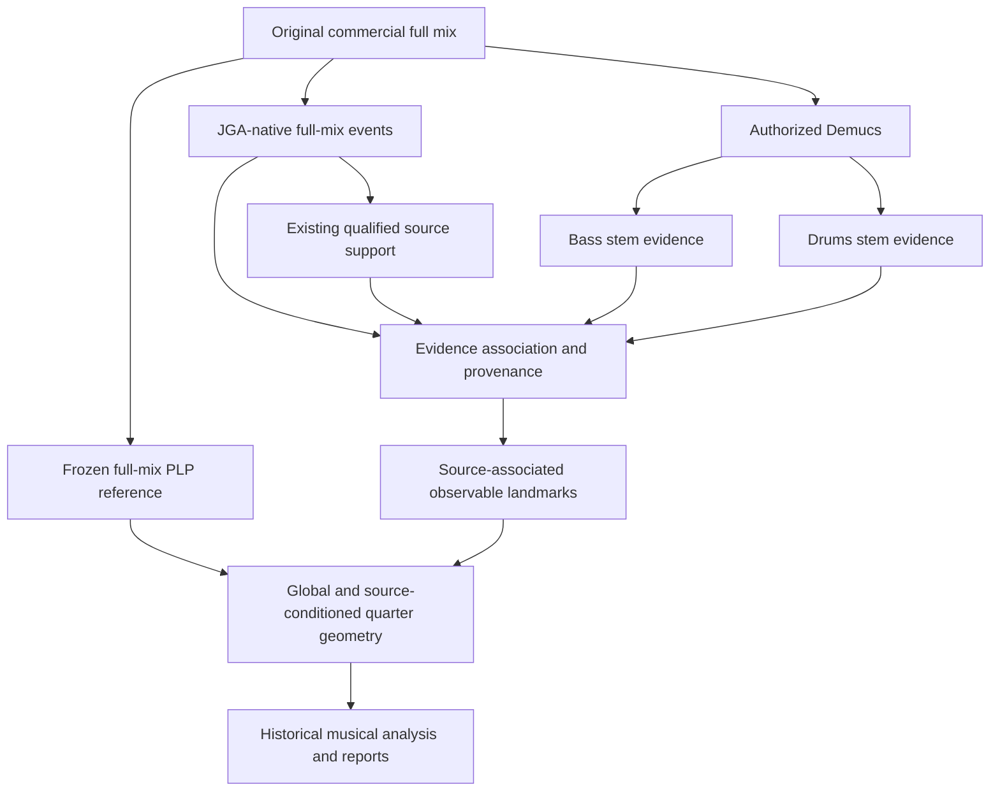

# JGA v1 hybrid historical-recording analysis architecture

Date: 2026-09-23. Classification: **PI ENGINEERING / OPERATIONAL-SCOPE DECISION**. Status: **ADOPTED — USABLE_WITH_QUALIFICATION**. JGA v1 methodological development is **CLOSED for operational historical analysis**. Current phase: **HISTORICAL JAZZ CORPUS ANALYSIS / REPORT PRODUCTION**.

This records the PI's explicit final adoption after review of the frozen full-mix versus stems diagnostic study. It supersedes earlier recommendations to continue methodological development as a prerequisite for bounded v1 observable-onset reporting. It does not claim new experimental validation, universal source recognition, physical attack accuracy, new software implementation or automatic generalization to an untested corpus. Existing research components and qualified semantics are adopted; runtime code is unchanged by this documentation freeze.

## Scientific result versus operational decision

The independent PLP preregistered result remains **FAIL**: 10 ALIGNED_THROUGHOUT, 10 MOSTLY_ALIGNED_LOCAL_ISSUES, 3 MISALIGNED, 1 UNCERTAIN; 24/24 responses. Its SHA-256 is `0355d78186ea4b79d1e1c0f99e634be674a41227f4faef19993351b84867100f`. Exactly Like You 5/5 is development evidence, outside that denominator. No thresholds, categories, negative evidence or old freezes change.

The later operational PLP quarter-nearest format was USABLE_WITH_QUALIFICATION for observable onset geometry. The source-conditioned view adds complementary coverage. The separator diagnostic found Bass and Drum COMPLEMENTARY, timing MIXED and Dual disambiguation LIMITED; its recommendation was HYBRID_DIAGNOSTIC_ONLY. **This subsequent PI decision adopts complementary evidence use without promoting stems to measurement Ground Truth.** It does not relabel the diagnostic outcome or the earlier physical-attack trial's PARTIALLY_USABLE result.

## Authority and architecture

1. **ORIGINAL FULL MIX**: primary historical document and operational signal authority. Hash the exact registered asset and preserve decoding lineage.
2. **Frozen/adopted PLP from the original full mix**: JGA v1 INTERNAL BPM / LOCAL-PULSE / operational QUARTER REFERENCE. Reuse frozen outputs where valid; never derive a competing operational ruler from stems. Ableton is an external benchmark only, not runtime authority. Historical pre-PLP grids remain historical.
3. **JGA-native full-mix events**: primary observable timestamps; unchanged acoustic detector and input lineage.
4. **Existing full-mix source support**: qualified Bass/Drum/Dual/UNKNOWN evidence, with all existing model dependencies and limitations retained. PLP does not identify instruments.
5. **Authorized Demucs**: complementary source/observability evidence, with exact model, configuration, source UUID, asset hashes and derived-asset lineage. It consumes the original audio, not event markers. Reuse valid stems; do not search for or tune separators.
6. **Evidence association and provenance**: associate compatible evidence while keeping original support, matching status and timestamp origin separately auditable.
7. **Two quarter-centered views and historical reports**: use the same frozen full-mix PLP ruler and independently established musical sections.

This is an operational reference for bounded observable geometry, **not final musical-quarter Ground Truth** and not proof that general-purpose metric selection/lock or tempo-existence software has been implemented. Those earlier proposed layers remain unimplemented, not prerequisites reopened by this v1 closure. Material corpus failures must be reported and brought to PI, not silently repaired.

## Evidence/provenance classes and timestamp rule

These are provenance categories, not calibrated confidence scores or independent accuracy guarantees. Retain the repository's exact source states (`BASS_SUPPORTED`, `DRUM_SUPPORTED`, `BASS_AND_DRUM_SUPPORTED`, `UNKNOWN`, and `CONFLICTING_EVIDENCE` where present), matching states and uncertainty qualifications. User-facing Bass/Drum/Dual labels are operational observable-landmark semantics.

| PI evidence class | Meaning | Coordinate / required handling |
|---|---|---|
| FULL-MIX + STEM CONFIRMED | Compatible full-mix and stem evidence; “confirmed” means cross-representation support, not independent truth | Use corresponding full-mix native timestamp; retain both evidence records and stem displacement |
| FULL-MIX SOURCE-SUPPORTED ONLY | Qualified native source support without compatible stem support | Preserve native timestamp and source support; missing stem is not a veto |
| STEM-ONLY SOURCE EVIDENCE | No compatible full-mix native event established | Keep `SEPARATOR_DERIVED / STEM_ONLY` separately, with original stem timestamp and lower/separate provenance; never invent a full-mix coordinate |
| SHARED / DUAL | One native timestamp, multiple source-support hypotheses | One event, not two attacks; shared selection stays `SHARED_DUAL_MARKER / UNRESOLVED` |
| UNKNOWN / AMBIGUOUS | Identity or matching not sufficiently resolved | Preserve uncertainty; do not force identity or choose a match opportunistically |

**STEM MAY HELP ANSWER WHO. FULL MIX SHOULD ANSWER WHEN WHEN A COMPATIBLE NATIVE EVENT EXISTS.** Compatible separator support may be associated with an existing native event even if its original support was UNKNOWN or different. Record that as an additive separator-derived hypothesis with its own provenance; do not overwrite the original frozen source label or portray it as independent model confirmation. If support conflicts, preserve both and the conflict/ambiguity. No source inference may depend on the sign or size of its displacement from PLP.

For the established detector/configuration, reuse the diagnostic rule: inclusive 512 samples at 44,100 Hz (one 512-sample hop, 11.609977 ms), complete bipartite compatibility graph, mutual degree-one matches only. Preserve exact `FULL_MIX_AND_STEM_MATCH`, `FULL_MIX_ONLY`, `STEM_ONLY`, `AMBIGUOUS_MATCH` and multiple-candidate evidence. Do not force equality, greedily resolve ambiguity, retune tolerance or use a PLP-centered matching gate. The bound is detector resolution, not physical timing uncertainty. Different unqualified detector/time-base conditions require PI review, not silent extrapolation.

When stems suggest separate Bass and Drum activity, create distinct full-mix-associated observations only if **distinct compatible native full-mix IDs and distinct timestamps** exist. Never duplicate one native coordinate into two timed attacks, invent a zero-ms pair from Dual, move a timestamp to obtain a match, or choose a second-best winner merely to manufacture a pair. Unmatched stem observations remain a distinct layer; they do not silently enter full-mix-only statistics.

## Quarter geometry and measurement

Preserve both views:

- **Global quarter-nearest:** continuous reference index; exact midpoint cells; earlier-reference ownership at an internal midpoint; nearest existing native event; frozen timestamp/ID tie handling; UNKNOWN eligible; no borrowing or cross-cell reuse; EMPTY when none; all other events remain CONTEXT.
- **Quarter-centered Bass/Drum:** same cells and ruler; independently nearest eligible existing source-supported observation per source. Shared Dual remains one marker. Distinct pair difference is `t_DRUM − t_BASS`, with provenance and unresolved cases explicit. Do not interpret lack of a global Bass winner as source absence.

The numerical geometry/tie implementations and reference figures are pinned in `AUTHORITY_REFERENCES.json`. Historical assignments remain unchanged. Future reports must disclose original versus complementary support and timestamp representation for each observation and keep source/provenance populations separate in statistics.

**DELTA_T = observable source-associated onset − PLP temporal reference.** Negative is before, positive after. No snapping of the event or ruler. +27 ms remains +27 ms. Do not invent an ON tolerance, physical uncertainty bound or calibrated confidence probability. Observable Bass–Drum onset-marker relationships are not exact performer microtiming.

## Graphical standard

Use the pinned existing plotting definitions, not a redesigned visual language. Bass-supported: `#286ea8`, circle `o` (unfilled where specified); Drum-supported: `#c66a16`, diamond `D`; Dual: `#8855ad`, square `s`; UNKNOWN: `#343a40`, triangle `^`; conflicting evidence: `#ad3434`, `X`. CONTEXT stays light gray `#bfc3c7`, with source-specific shapes in the source-aware view. Preserve exact figure-specific sizes, opacity, reference guides, EMPTY rails, section styling, legends and zoom semantics from the referenced plotting code; no universal replacement sizing rule is introduced.

Every report retains selected and context observations, EMPTY, source/provenance qualification and independently defined sections. Distinguish full-mix versus separator-derived observations. Shared Dual is drawn as one event; never visually imply stems are Ground Truth. Raw PLP inter-peak BPM must be labelled **RAW / DISCRETE**, including the timestamp-lattice warning; jaggedness is not automatically performer acceleration/deceleration. No cosmetic smoothing is adopted.

## Scope, limitations and research closure

**4/4 PRIMARY; 3/4 SUPPORTED / SECONDARY.** 5/4 and other odd meters are FUTURE / JGA v2 unless separately reopened. Open/free endings lacking useful metric authority are excluded prospectively using independent form evidence, not favorable-result selection. Their historical negative/qualified evidence remains intact.

JGA v1 measures **SOURCE-ASSOCIATED OBSERVABLE ONSET GEOMETRY**, not exact finger release, stick contact or sample-perfect physical performer attacks. Universal Double-Bass identity and physical full-mix Bass–Drum microtiming remain unestablished. Generic Drum evidence is not Ride/Hi-Hat evidence. Stems may leak, suppress, smear or create activity. Compatible timing is not proof of identity, and unmatched evidence is not proof of physical absence. No numerical confidence is invented from a provenance class.

The following move to FUTURE RESEARCH / JGA v2 unless new corpus evidence creates a material blocker: physical Bass attack metrology; universal Double-Bass identity; Ride-specific and Hi-Hat-specific full-mix timing; odd-meter expansion; open-ending authority; alternative separators/source models; PLP attack-prior research. The failed restrictive ±20/40/60-ms PLP proximity prior is not integrated. Essentia / BeatNet / madmom / Beat This! remain deferred. No new experiment, model execution, historical recalculation or runtime implementation is authorized or executed in this closure.

**Next action:** Prepare the first historical-jazz analysis/report batch using this frozen architecture. This closure stops before batch execution and does not automatically start another methodological experiment.
